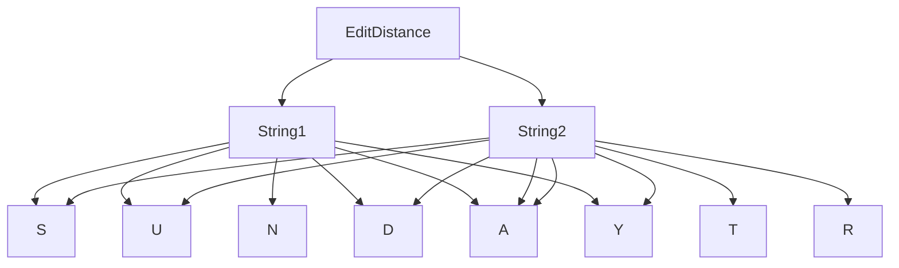

# Dynamic Programming: Edit Distance

## Problem Statement

We are given two strings `S1` and `S2`. We need to convert `S1` to `S2`. The following three operations are allowed:

1. Deletion of a character.
2. Replacement of a character with another one.
3. Insertion of a character.

We have to return the minimum number of operations required to convert `S1` to `S2` as our answer.

### Recurrence Relation

$$ \text{editDist}(i, j) = \text{editDist}(i-1, j-1) \text{ if } S1[i-1] == S2[j-1] $$

$$ \text{editDist}(i, j) = 1 + \min(\text{editDist}(i-1, j), \text{editDist}(i, j-1), \text{editDist}(i-1, j-1)) \text{ if } S1[i-1] \neq S2[j-1] $$

### 1. Edit Distance using Recursion

Recursion is the simplest way to solve the Edit Distance problem, but it has a high computational cost due to repeated calculations.

```c
#include <stdio.h>
#include <string.h>

// Function to find minimum of three numbers
int min(int x, int y, int z) {
    return (x < y) ? ((x < z) ? x : z) : ((y < z) ? y : z);
}

// Function to calculate Edit Distance using recursion
int editDistance(char* str1, char* str2, int m, int n) {
    if (m == 0) return n;
    if (n == 0) return m;

    if (str1[m - 1] == str2[n - 1]) {
        return editDistance(str1, str2, m - 1, n - 1);
    }

    return 1 + min(editDistance(str1, str2, m - 1, n), 
                   editDistance(str1, str2, m, n - 1), 
                   editDistance(str1, str2, m - 1, n - 1));
}

int main() {
    char str1[] = "sunday";
    char str2[] = "saturday";
    printf("Minimum edit distance is %d\n", editDistance(str1, str2, strlen(str1), strlen(str2)));
    return 0;
}
```

**Explanation**:
- This function calls itself recursively to compute the edit distance.
- It results in a lot of redundant calculations, making it inefficient for large strings.

### 2. Edit Distance using Memoization

Memoization is an optimization technique where we store the results of expensive function calls and reuse them when the same inputs occur again.

```c
#include <stdio.h>
#include <string.h>

#define MAX 1000

// Function to find minimum of three numbers
int min(int x, int y, int z) {
    return (x < y) ? ((x < z) ? x : z) : ((y < z) ? y : z);
}

// Function to calculate Edit Distance using memoization
int editDistance(char* str1, char* str2, int m, int n, int memo[MAX][MAX]) {
    if (m == 0) return n;
    if (n == 0) return m;

    if (memo[m][n] != -1) {
        return memo[m][n]; // Return the stored result if it exists
    }

    if (str1[m - 1] == str2[n - 1]) {
        memo[m][n] = editDistance(str1, str2, m - 1, n - 1, memo);
    } else {
        memo[m][n] = 1 + min(editDistance(str1, str2, m - 1, n, memo), 
                             editDistance(str1, str2, m, n - 1, memo), 
                             editDistance(str1, str2, m - 1, n - 1, memo));
    }
    return memo[m][n];
}

int main() {
    char str1[] = "sunday";
    char str2[] = "saturday";
    int memo[MAX][MAX];
    for (int i = 0; i < MAX; i++) {
        for (int j = 0; j < MAX; j++) {
            memo[i][j] = -1; // Initialize memo array with -1
        }
    }
    printf("Minimum edit distance is %d\n", editDistance(str1, str2, strlen(str1), strlen(str2), memo));
    return 0;
}
```

**Explanation**:
- We use a 2D array `memo` to store the results of the edit distance subproblems as we compute them.
- This avoids redundant calculations, making the function much more efficient.

### 3. Edit Distance using Dynamic Programming (Tabulation)

In dynamic programming, we solve the problem in a bottom-up manner, starting from the base cases and building up to the desired solution.

```c
#include <stdio.h>
#include <string.h>

// Function to find minimum of three numbers
int min(int x, int y, int z) {
    return (x < y) ? ((x < z) ? x : z) : ((y < z) ? y : z);
}

// Function to calculate Edit Distance using dynamic programming (tabulation)
int editDistance(char* str1, char* str2, int m, int n) {
    int dp[m + 1][n + 1];

    for (int i = 0; i <= m; i++) {
        for (int j = 0; j <= n; j++) {
            if (i == 0) {
                dp[i][j] = j; // If first string is empty, insert all characters of second string
            } else if (j == 0) {
                dp[i][j] = i; // If second string is empty, remove all characters of first string
            } else if (str1[i - 1] == str2[j - 1]) {
                dp[i][j] = dp[i - 1][j - 1]; // If characters are the same, no operation needed
            } else {
                dp[i][j] = 1 + min(dp[i - 1][j], dp[i][j - 1], dp[i - 1][j - 1]); // Min of insert, delete, replace
            }
        }
    }

    return dp[m][n];
}

int main() {
    char str1[] = "sunday";
    char str2[] = "saturday";
    printf("Minimum edit distance is %d\n", editDistance(str1, str2, strlen(str1), strlen(str2)));
    return 0;
}
```

**Explanation**:
- We use a 2D array `dp` to store the edit distances for all subproblems.
- We fill the `dp` array in a bottom-up manner, ensuring that each subproblem is solved only once.

### Diagram

The following diagram shows the table used to compute the edit distance. Each cell represents the minimum edit distance for the prefixes of the two strings up to the given indices:



### Explanation

- **Recursion**: The function calls itself repeatedly to compute the minimum edit distance. It results in a lot of redundant calculations.
- **Memoization**: The function stores the results of the subproblems in a 2D array to avoid redundant calculations.
- **Dynamic Programming (Tabulation)**: The function builds the solution from the bottom up, storing the results in a 2D array.

## Summary

Dynamic programming is a powerful technique for solving problems with overlapping subproblems and optimal substructure. By storing the results of subproblems, we can avoid redundant calculations and achieve significant performance improvements. The Edit Distance example illustrates how dynamic programming can be applied in practice, providing a foundation for tackling more complex problems.

## Related Resources

- [Introduction to Algorithms by Cormen, Leiserson, Rivest, and Stein](https://mitpress.mit.edu/books/introduction-algorithms)
- [GeeksforGeeks - Dynamic Programming](https://www.geeksforgeeks.org/dynamic-programming/)
- [HackerRank - Dynamic Programming](https://www.hackerrank.com/domains/tutorials/10-days-of-dp)
- [LeetCode - Dynamic Programming Problems](https://leetcode.com/tag/dynamic-programming/)
- [Take U Forward - Edit Distance](https://takeuforward.org/data-structure/edit-distance-dp-33/)

## Related Video

[](https://www.youtube.com/watch?v=fJaKO8FbDdo)


---
