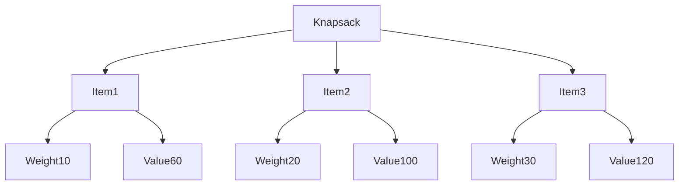

# Dynamic Programming: Knapsack Problem

## Problem Statement: 0/1 Knapsack Problem

Given weights and values of `n` items, put these items in a knapsack of capacity `W` to get the maximum total value in the knapsack. Each item can either be included or excluded from the knapsack.

### Recurrence Relation

\[ V[i, w] = \max(V[i-1, w], V[i-1, w-wt[i]] + val[i]) \text{ if } wt[i] \leq w \]  
\[ V[i, w] = V[i-1, w] \text{ if } wt[i] > w \]

### 1. Knapsack using Recursion

Recursion is the simplest way to solve the Knapsack problem, but it has a high computational cost due to repeated calculations.

```c
#include <stdio.h>

// Function to calculate the maximum of two integers
int max(int a, int b) {
    return (a > b) ? a : b;
}

// Function to solve the Knapsack problem using recursion
int knapsack(int W, int wt[], int val[], int n) {
    if (n == 0 || W == 0) {
        return 0;
    }
    if (wt[n - 1] > W) {
        return knapsack(W, wt, val, n - 1);
    } else {
        return max(val[n - 1] + knapsack(W - wt[n - 1], wt, val, n - 1), knapsack(W, wt, val, n - 1));
    }
}

int main() {
    int val[] = {60, 100, 120};
    int wt[] = {10, 20, 30};
    int W = 50;
    int n = sizeof(val) / sizeof(val[0]);
    printf("Maximum value in Knapsack = %d\n", knapsack(W, wt, val, n));
    return 0;
}
```

**Explanation**:
- This function calls itself recursively to compute the maximum value in the knapsack.
- It results in a lot of redundant calculations, making it inefficient for large `n`.

### 2. Knapsack using Memoization

Memoization is an optimization technique where we store the results of expensive function calls and reuse them when the same inputs occur again.

```c
#include <stdio.h>

#define MAX 1000

// Function to calculate the maximum of two integers
int max(int a, int b) {
    return (a > b) ? a : b;
}

// Function to solve the Knapsack problem using memoization
int knapsack(int W, int wt[], int val[], int n, int memo[MAX][MAX]) {
    if (n == 0 || W == 0) {
        return 0;
    }
    if (memo[n][W] != -1) {
        return memo[n][W];
    }
    if (wt[n - 1] > W) {
        memo[n][W] = knapsack(W, wt, val, n - 1, memo);
    } else {
        memo[n][W] = max(val[n - 1] + knapsack(W - wt[n - 1], wt, val, n - 1, memo), knapsack(W, wt, val, n - 1, memo));
    }
    return memo[n][W];
}

int main() {
    int val[] = {60, 100, 120};
    int wt[] = {10, 20, 30};
    int W = 50;
    int n = sizeof(val) / sizeof(val[0]);
    int memo[MAX][MAX];
    for (int i = 0; i < MAX; i++) {
        for (int j = 0; j < MAX; j++) {
            memo[i][j] = -1; // Initialize memo array with -1
        }
    }
    printf("Maximum value in Knapsack = %d\n", knapsack(W, wt, val, n, memo));
    return 0;
}
```

**Explanation**:
- We use a 2D array `memo` to store the results of the subproblems as we compute them.
- This avoids redundant calculations, making the function much more efficient.

### 3. Knapsack using Dynamic Programming (Tabulation)

In dynamic programming, we solve the problem in a bottom-up manner, starting from the base cases and building up to the desired solution.

```c
#include <stdio.h>

// Function to calculate the maximum of two integers
int max(int a, int b) {
    return (a > b) ? a : b;
}

// Function to solve the Knapsack problem using dynamic programming (tabulation)
int knapsack(int val[], int wt[], int n, int W) {
    int dp[n + 1][W + 1];

    for (int i = 0; i <= n; i++) {
        for (int w = 0; w <= W; w++) {
            if (i == 0 || w == 0) {
                dp[i][w] = 0; // Base case: If no items or no capacity, value is 0
            } else if (wt[i - 1] <= w) {
                dp[i][w] = max(val[i - 1] + dp[i - 1][w - wt[i - 1]], dp[i - 1][w]); // Include or exclude the item
            } else {
                dp[i][w] = dp[i - 1][w]; // Exclude the item
            }
        }
    }

    return dp[n][W];
}

int main() {
    int val[] = {60, 100, 120};
    int wt[] = {10, 20, 30};
    int W = 50;
    int n = sizeof(val) / sizeof(val[0]);

    printf("Maximum value in Knapsack = %d\n", knapsack(val, wt, n, W));
    return 0;
}
```

**Explanation**:
- We use a 2D array `dp` to store the maximum values for all subproblems.
- We fill the `dp` array in a bottom-up manner, ensuring that each subproblem is solved only once.

### Diagram

The following diagram shows the table used to compute the knapsack problem. Each cell represents the maximum value achievable with the given weight capacity and the available items:



### Explanation

- **Recursion**: The function calls itself repeatedly to compute the maximum value in the knapsack. It results in a lot of redundant calculations.
- **Memoization**: The function stores the results of the subproblems in a 2D array to avoid redundant calculations.
- **Dynamic Programming (Tabulation)**: The function builds the solution from the bottom up, storing the results in a 2D array.

## Conclusion

Dynamic programming is a powerful technique for solving problems with overlapping subproblems and optimal substructure. By storing the results of subproblems, we can avoid redundant calculations and achieve significant performance improvements. The Knapsack problem example illustrates how dynamic programming can be applied in practice, providing a foundation for tackling more complex problems.

## Related Resources

- [Introduction to Algorithms by Cormen, Leiserson, Rivest, and Stein](https://mitpress.mit.edu/books/introduction-algorithms)
- [GeeksforGeeks - Dynamic Programming](https://www.geeksforgeeks.org/dynamic-programming/)
- [HackerRank - Dynamic Programming](https://www.hackerrank.com/domains/tutorials/10-days-of-dp)
- [LeetCode - Dynamic Programming Problems](https://leetcode.com/tag/dynamic-programming/)


## Related Video

[](https://youtu.be/zRza99HPvkQ?si=7VOPb1S3XIKfiTa5)

