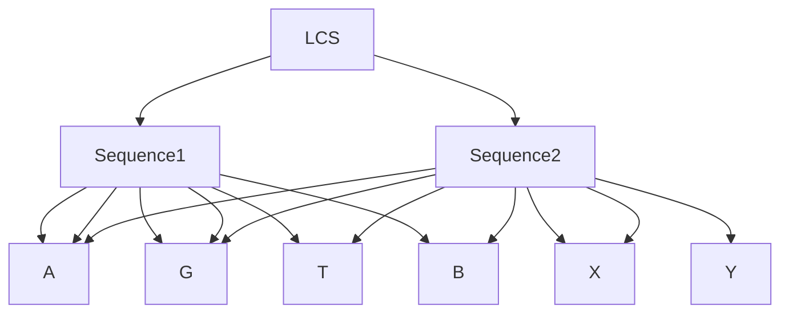

# Dynamic Programming: Longest Common Subsequence (LCS)

## What is Dynamic Programming?

Dynamic Programming (DP) is a method for solving complex problems by breaking them down into simpler subproblems. It is applicable to problems that exhibit the properties of overlapping subproblems and optimal substructure. DP is often used for optimization problems where the goal is to find the best solution among many possible solutions.

### Key Concepts

1. **Overlapping Subproblems**: This property indicates that the problem can be broken down into smaller subproblems, which are reused several times.
2. **Optimal Substructure**: This property means that the optimal solution to the problem can be constructed from the optimal solutions of its subproblems.
3. **Memoization**: This technique involves storing the results of expensive function calls and reusing them when the same inputs occur again.
4. **Tabulation**: This technique involves building a table in a bottom-up manner to solve the subproblems first and then solve the main problem.

## Example: Longest Common Subsequence (LCS)

The Longest Common Subsequence (LCS) problem is a classic example of how dynamic programming can be applied. The LCS problem is to find the longest subsequence common to all sequences in a set of sequences. A subsequence is a sequence that appears in the same relative order but not necessarily consecutively.

### Problem Statement

Given two sequences, find the length of the longest subsequence present in both of them.

### Recurrence Relation

$$
\text{LCS}(i, j) = \text{LCS}(i-1, j-1) + 1 \text{ if } X[i-1] == Y[j-1]
$$

$$
\text{LCS}(i, j) = \max(\text{LCS}(i-1, j), \text{LCS}(i, j-1)) \text{ if } X[i-1] \neq Y[j-1]
$$

### 1. LCS using Recursion

Recursion is the simplest way to solve the LCS problem, but it has a high computational cost due to repeated calculations.

```c
#include <stdio.h>
#include <string.h>

// Function to calculate LCS using recursion
int lcs(char* X, char* Y, int m, int n) {
    if (m == 0 || n == 0) {
        return 0; // Base case: If either string is empty, LCS is 0
    }
    if (X[m - 1] == Y[n - 1]) {
        return 1 + lcs(X, Y, m - 1, n - 1); // Characters match, move both indices
    } else {
        return max(lcs(X, Y, m, n - 1), lcs(X, Y, m - 1, n)); // Characters don't match, move one index at a time
    }
}

// Helper function to find the maximum of two numbers
int max(int a, int b) {
    return (a > b) ? a : b;
}

int main() {
    char X[] = "AGGTAB";
    char Y[] = "GXTXAYB";
    int m = strlen(X);
    int n = strlen(Y);
    printf("Length of LCS is %d\n", lcs(X, Y, m, n));
    return 0;
}
```

**Explanation**:
- This function calls itself recursively to compute the LCS.
- It results in a lot of redundant calculations, making it inefficient for large sequences.

### 2. LCS using Memoization

Memoization is an optimization technique where we store the results of expensive function calls and reuse them when the same inputs occur again.

```c
#include <stdio.h>
#include <string.h>

#define MAX 1000

// Function to calculate LCS using memoization
int lcs(char* X, char* Y, int m, int n, int memo[MAX][MAX]) {
    if (m == 0 || n == 0) {
        return 0; // Base case: If either string is empty, LCS is 0
    }
    if (memo[m][n] != -1) {
        return memo[m][n]; // Return the stored result if it exists
    }
    if (X[m - 1] == Y[n - 1]) {
        memo[m][n] = 1 + lcs(X, Y, m - 1, n - 1, memo); // Characters match, move both indices
    } else {
        memo[m][n] = max(lcs(X, Y, m, n - 1, memo), lcs(X, Y, m - 1, n, memo)); // Characters don't match, move one index at a time
    }
    return memo[m][n];
}

// Helper function to find the maximum of two numbers
int max(int a, int b) {
    return (a > b) ? a : b;
}

int main() {
    char X[] = "AGGTAB";
    char Y[] = "GXTXAYB";
    int m = strlen(X);
    int n = strlen(Y);
    int memo[MAX][MAX];
    for (int i = 0; i < MAX; i++) {
        for (int j = 0; j < MAX; j++) {
            memo[i][j] = -1; // Initialize memo array with -1
        }
    }
    printf("Length of LCS is %d\n", lcs(X, Y, m, n, memo));
    return 0;
}
```

**Explanation**:
- We use a 2D array `memo` to store the results of the LCS subproblems as we compute them.
- This avoids redundant calculations, making the function much more efficient.

### 3. LCS using Dynamic Programming (Tabulation)

In dynamic programming, we solve the problem in a bottom-up manner, starting from the base cases and building up to the desired solution.

```c
#include <stdio.h>
#include <string.h>

// Function to calculate LCS using dynamic programming (tabulation)
int lcs(char* X, char* Y, int m, int n) {
    int dp[m + 1][n + 1];

    for (int i = 0; i <= m; i++) {
        for (int j = 0; j <= n; j++) {
            if (i == 0 || j == 0) {
                dp[i][j] = 0; // Base case: If either string is empty, LCS is 0
            } else if (X[i - 1] == Y[j - 1]) {
                dp[i][j] = dp[i - 1][j - 1] + 1; // Characters match, add 1 to the result
            } else {
                dp[i][j] = max(dp[i - 1][j], dp[i][j - 1]); // Characters don't match, take the maximum
            }
        }
    }

    return dp[m][n];
}

// Helper function to find the maximum of two numbers
int max(int a, int b) {
    return (a > b) ? a : b;
}

int main() {
    char X[] = "AGGTAB";
    char Y[] = "GXTXAYB";
    int m = strlen(X);
    int n = strlen(Y);
    printf("Length of LCS is %d\n", lcs(X, Y, m, n));
    return 0;
}
```

**Explanation**:
- We use a 2D array `dp` to store the LCS lengths for all subproblems.
- We fill the `dp` array in a bottom-up manner, ensuring that each subproblem is solved only once.

### Diagram

The following diagram shows the table used to compute the longest common subsequence. Each cell represents the length of the LCS for the prefixes of the two sequences up to the given indices:



### Explanation

- **Recursion**: The function calls itself repeatedly to compute the length of the LCS. It results in a lot of redundant calculations.
- **Memoization**: The function stores the results of the subproblems in a 2D array to avoid redundant calculations.
- **Dynamic Programming (Tabulation)**: The function builds the solution from the bottom up, storing the results in a 2D array.

## Conclusion

Dynamic programming is a powerful technique for solving problems with overlapping subproblems and optimal substructure. By storing the results of subproblems, we can avoid redundant calculations and achieve significant performance improvements. The LCS example illustrates how dynamic programming can be applied in practice, providing a foundation for tackling more complex problems.

## Related Resources

- [Introduction to Algorithms by Cormen, Leiserson, Rivest, and Stein](https://mitpress.mit.edu/books/introduction-algorithms)
- [GeeksforGeeks - Dynamic Programming](https://www.geeksforgeeks.org/dynamic-programming/)
- [HackerRank - Dynamic Programming](https://www.hackerrank.com/domains/tutorials/10-days-of-dp)
- [LeetCode - Dynamic Programming Problems](https://leetcode.com/tag/dynamic-programming/)

## Related Video

[](https://youtu.be/sSno9rV8Rhg?si=zGg2RrhXFVh1PP5r)

---
