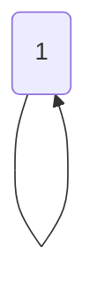

# Introduction to Memoization

Memoization is an optimization technique used to speed up computer programs by storing the results of expensive function calls and reusing them when the same inputs occur again. This technique is particularly useful for dynamic programming problems where the same subproblems are solved multiple times.

## Key Concepts

1. **Caching**: Store the results of expensive function calls.
2. **Lookup**: Retrieve stored results when the same inputs occur again.
3. **Efficiency**: Avoid redundant calculations, thereby improving the performance.

## Example 1: Fibonacci Sequence

The Fibonacci sequence is a classic example where memoization can be applied. The sequence is defined as:

\[ F(n) = F(n-1) + F(n-2) \]
with base cases:
\[ F(0) = 0 \]
\[ F(1) = 1 \]

### Recursion without Memoization

Here's how you would typically implement the Fibonacci sequence using simple recursion:

```c
#include <stdio.h>

int fibonacci(int n) {
    if (n <= 1) {
        return n;
    }
    return fibonacci(n - 1) + fibonacci(n - 2);
}

int main() {
    int n = 10;
    printf("Fibonacci number at position %d is %d\n", n, fibonacci(n));
    return 0;
}
```

### Memoized Fibonacci

Using memoization, we store the results of each Fibonacci number as we compute them:

```c
#include <stdio.h>

#define MAX 1000

int fibonacci(int n, int memo[]) {
    if (memo[n] != -1) {
        return memo[n];
    }
    if (n <= 1) {
        memo[n] = n;
    } else {
        memo[n] = fibonacci(n - 1, memo) + fibonacci(n - 2, memo);
    }
    return memo[n];
}

int main() {
    int n = 10;
    int memo[MAX];
    for (int i = 0; i < MAX; i++) {
        memo[i] = -1;
    }
    printf("Fibonacci number at position %d is %d\n", n, fibonacci(n, memo));
    return 0;
}
```

### Diagram

The following diagram shows how memoization works for the Fibonacci sequence. Each node represents a Fibonacci number, and we store the result of each node to avoid redundant calculations.


## Example 2: Factorial Calculation

Another simple example of memoization is the calculation of factorials. The factorial of a number \( n \) is defined as:

\[ n! = n \times (n-1) \times (n-2) \times ... \times 1 \]

### Factorial without Memoization

Here's how you would typically implement the factorial using simple recursion:

```c
#include <stdio.h>

int factorial(int n) {
    if (n <= 1) {
        return 1;
    }
    return n * factorial(n - 1);
}

int main() {
    int n = 5;
    printf("Factorial of %d is %d\n", n, factorial(n));
    return 0;
}
```

### Memoized Factorial

Using memoization, we store the results of each factorial calculation as we compute them:

```c
#include <stdio.h>

#define MAX 1000

int factorial(int n, int memo[]) {
    if (memo[n] != -1) {
        return memo[n];
    }
    if (n <= 1) {
        memo[n] = 1;
    } else {
        memo[n] = n * factorial(n - 1, memo);
    }
    return memo[n];
}

int main() {
    int n = 5;
    int memo[MAX];
    for (int i = 0; i < MAX; i++) {
        memo[i] = -1;
    }
    printf("Factorial of %d is %d\n", n, factorial(n, memo));
    return 0;
}
```

### Diagram

The following diagram shows how memoization works for the factorial calculation. Each node represents a factorial value, and we store the result of each node to avoid redundant calculations.



## Example 3: Climbing Stairs

You are climbing a staircase. It takes \( n \) steps to reach the top. Each time you can either climb 1 or 2 steps. In how many distinct ways can you climb to the top?

### Recurrence Relation

\[ C(n) = C(n-1) + C(n-2) \]
with base cases:
\[ C(0) = 1 \]
\[ C(1) = 1 \]

### Climbing Stairs without Memoization

```c
#include <stdio.h>

int climbStairs(int n) {
    if (n <= 1) {
        return 1;
    }
    return climbStairs(n - 1) + climbStairs(n - 2);
}

int main() {
    int n = 5;
    printf("Number of ways to climb %d stairs is %d\n", n, climbStairs(n));
    return 0;
}
```

### Memoized Climbing Stairs

Using memoization, we store the results of each calculation as we compute them:

```c
#include <stdio.h>

#define MAX 1000

int climbStairs(int n, int memo[]) {
    if (memo[n] != -1) {
        return memo[n];
    }
    if (n <= 1) {
        memo[n] = 1;
    } else {
        memo[n] = climbStairs(n - 1, memo) + climbStairs(n - 2, memo);
    }
    return memo[n];
}

int main() {
    int n = 5;
    int memo[MAX];
    for (int i = 0; i < MAX; i++) {
        memo[i] = -1;
    }
    printf("Number of ways to climb %d stairs is %d\n", n, climbStairs(n, memo));
    return 0;
}
```

### Diagram

The following diagram shows how memoization works for the climbing stairs problem. Each node represents the number of ways to climb a certain number of stairs, and we store the result of each node to avoid redundant calculations.


## Summary

Memoization is a powerful technique to optimize recursive algorithms by storing results of subproblems and reusing them when the same subproblems occur again. It can significantly improve the performance of algorithms that solve the same subproblems multiple times.

## Related Resources

- [GeeksforGeeks - Memoization](https://www.geeksforgeeks.org/memoization-1d-2d-and-3d/)
- [HackerRank - Dynamic Programming](https://www.hackerrank.com/domains/tutorials/10-days-of-dp)
- [LeetCode - Dynamic Programming Problems](https://leetcode.com/tag/dynamic-programming/)

### Related Video

[](https://www.youtube.com/watch?v=OQ5jsbhAv_M)

---
