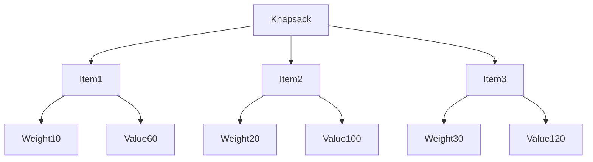
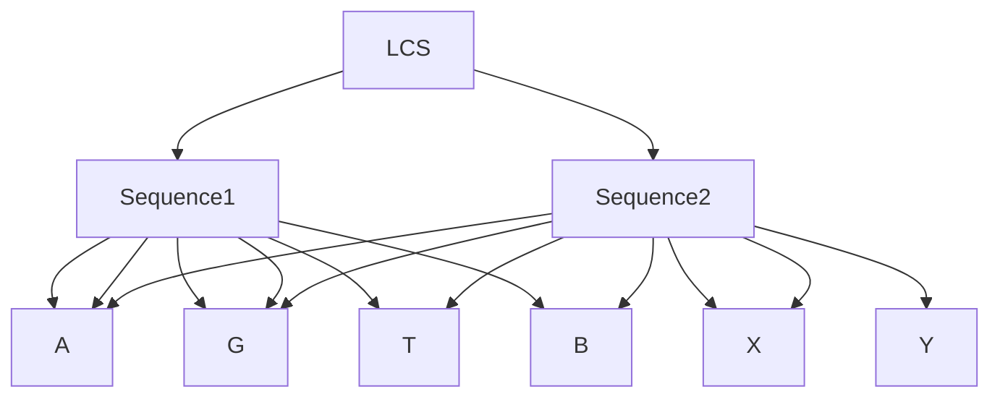

---

# Dynamic Programming 

## What is Dynamic Programming?

Dynamic Programming (DP) is a method for solving complex problems by breaking them down into simpler subproblems. It is applicable to problems that exhibit the properties of overlapping subproblems and optimal substructure. DP is often used for optimization problems where the goal is to find the best solution among many possible solutions.

### Key Concepts

1. **Overlapping Subproblems**: Problems can be broken down into smaller, reusable subproblems.
2. **Optimal Substructure**: The optimal solution to a problem can be constructed from the optimal solutions of its subproblems.
3. **Memoization**: Storing the results of expensive function calls and reusing them when the same inputs occur again.
4. **Tabulation**: Building a table in a bottom-up manner to solve the subproblems first and then solve the main problem.

## Example 1: Fibonacci Sequence

The Fibonacci sequence is a classic example of a problem that can be solved using dynamic programming.

### Recurrence Relation

\[ F(n) = F(n-1) + F(n-2) \]
with base cases:
\[ F(0) = 0 \]
\[ F(1) = 1 \]

### Memoization Approach

```c
#include <stdio.h>

#define MAX 1000

int fibonacci(int n, int memo[]) {
    if (memo[n] != -1) {
        return memo[n];
    }
    if (n <= 1) {
        memo[n] = n;
    } else {
        memo[n] = fibonacci(n-1, memo) + fibonacci(n-2, memo);
    }
    return memo[n];
}

int main() {
    int n = 10;
    int memo[MAX];
    for (int i = 0; i < MAX; i++) {
        memo[i] = -1;
    }
    printf("Fibonacci number at position %d is %d\n", n, fibonacci(n, memo));
    return 0;
}
```

### Tabulation Approach

```c
#include <stdio.h>

int fibonacci(int n) {
    if (n <= 1) {
        return n;
    }
    int dp[n + 1];
    dp[0] = 0;
    dp[1] = 1;
    for (int i = 2; i <= n; i++) {
        dp[i] = dp[i - 1] + dp[i - 2];
    }
    return dp[n];
}

int main() {
    int n = 10;
    printf("Fibonacci number at position %d is %d\n", n, fibonacci(n));
    return 0;
}
```

### Diagram

The following diagram shows the breakdown of the Fibonacci calculation using dynamic programming. Each node represents a Fibonacci number that is calculated, and the arrows show the recursive calls:


## Example 2: 0/1 Knapsack Problem

Given weights and values of `n` items, put these items in a knapsack of capacity `W` to get the maximum total value in the knapsack.

### Recurrence Relation

\[ V[i, w] = \max(V[i-1, w], V[i-1, w-wt[i]] + val[i]) \text{ if } wt[i] \leq w \]
\[ V[i, w] = V[i-1, w] \text{ if } wt[i] > w \]

### Tabulation Approach

```c
#include <stdio.h>

int knapsack(int values[], int weights[], int n, int W) {
    int dp[n + 1][W + 1];

    for (int i = 0; i <= n; i++) {
        for (int w = 0; w <= W; w++) {
            if (i == 0 || w == 0) {
                dp[i][w] = 0;
            } else if (weights[i - 1] <= w) {
                dp[i][w] = (values[i - 1] + dp[i - 1][w - weights[i - 1]] > dp[i - 1][w])
                            ? values[i - 1] + dp[i - 1][w - weights[i - 1]]
                            : dp[i - 1][w];
            } else {
                dp[i][w] = dp[i - 1][w];
            }
        }
    }

    return dp[n][W];
}

int main() {
    int values[] = {60, 100, 120};
    int weights[] = {10, 20, 30};
    int W = 50;
    int n = sizeof(values) / sizeof(values[0]);

    printf("Maximum value in Knapsack = %d\n", knapsack(values, weights, n, W));
    return 0;
}
```

### Diagram

The following diagram shows the table used in the knapsack problem. Each cell represents the maximum value achievable with the given weight capacity and the available items:



## Example 3: Longest Common Subsequence (LCS)

Given two sequences, find the length of the longest subsequence present in both of them. A subsequence is a sequence that appears in the same relative order but not necessarily consecutively.

### Recurrence Relation

\[ LCS[i, j] = LCS[i-1, j-1] + 1 \text{ if } X[i] = Y[j] \]
\[ LCS[i, j] = \max(LCS[i-1, j], LCS[i, j-1]) \text{ if } X[i] \neq Y[j] \]

### Tabulation Approach

```c
#include <stdio.h>
#include <string.h>

int lcs(char *X, char *Y, int m, int n) {
    int dp[m + 1][n + 1];

    for (int i = 0; i <= m; i++) {
        for (int j = 0; j <= n; j++) {
            if (i == 0 || j == 0) {
                dp[i][j] = 0;
            } else if (X[i - 1] == Y[j - 1]) {
                dp[i][j] = dp[i - 1][j - 1] + 1;
            } else {
                dp[i][j] = (dp[i - 1][j] > dp[i][j - 1]) ? dp[i - 1][j] : dp[i][j - 1];
            }
        }
    }

    return dp[m][n];
}

int main() {
    char X[] = "AGGTAB";
    char Y[] = "GXTXAYB";
    int m = strlen(X);
    int n = strlen(Y);

    printf("Length of LCS is %d\n", lcs(X, Y, m, n));
    return 0;
}
```

### Diagram

The following diagram shows the table used to compute the longest common subsequence. Each cell represents the length of the LCS for the prefixes of the two sequences up to the given indices:



## Interview Problems with Solutions

### Problem 1: Minimum Edit Distance

Given two strings, find the minimum number of operations required to convert one string into the other. The allowed operations are insertion, deletion, or substitution of a character.

#### Solution in C

```c
#include <stdio.h>
#include <string.h>

int min(int x, int y, int z) {
    return (x < y) ? ((x < z) ? x : z) : ((y < z) ? y : z);
}

int editDistance(char *str1, char *str2, int m, int n) {
    int dp[m + 1][n + 1];

    for (int i = 0; i <= m; i++) {
        for (int j = 0; j <= n; j++) {
            if (i == 0) {
                dp[i][j]

 = j;
            } else if (j == 0) {
                dp[i][j] = i;
            } else if (str1[i - 1] == str2[j - 1]) {
                dp[i][j] = dp[i - 1][j - 1];
            } else {
                dp[i][j] = 1 + min(dp[i - 1][j], dp[i][j - 1], dp[i - 1][j - 1]);
            }
        }
    }

    return dp[m][n];
}

int main() {
    char str1[] = "sunday";
    char str2[] = "saturday";
    printf("Minimum edit distance is %d\n", editDistance(str1, str2, strlen(str1), strlen(str2)));
    return 0;
}
```

### Explanation

In the minimum edit distance problem, we use a 2D array `dp` where `dp[i][j]` represents the minimum number of operations required to convert the first `i` characters of `str1` to the first `j` characters of `str2`. We fill this table based on the recurrence relation:

- If the characters are the same, no new operation is needed: `dp[i][j] = dp[i-1][j-1]`.
- If the characters are different, we consider the minimum cost among insertion, deletion, and substitution: `dp[i][j] = 1 + min(dp[i-1][j], dp[i][j-1], dp[i-1][j-1])`.

### Problem 2: Coin Change Problem

Given a set of coins and a total amount, find the minimum number of coins needed to make the amount.

#### Solution in C

```c
#include <stdio.h>
#include <limits.h>

int minCoins(int coins[], int m, int V) {
    int dp[V + 1];
    dp[0] = 0;

    for (int i = 1; i <= V; i++) {
        dp[i] = INT_MAX;
    }

    for (int i = 1; i <= V; i++) {
        for (int j = 0; j < m; j++) {
            if (coins[j] <= i) {
                int sub_res = dp[i - coins[j]];
                if (sub_res != INT_MAX && sub_res + 1 < dp[i]) {
                    dp[i] = sub_res + 1;
                }
            }
        }
    }

    return dp[V];
}

int main() {
    int coins[] = {1, 2, 5};
    int m = sizeof(coins) / sizeof(coins[0]);
    int V = 11;
    printf("Minimum coins required is %d\n", minCoins(coins, m, V));
    return 0;
}
```

### Explanation

In the coin change problem, we use a 1D array `dp` where `dp[i]` represents the minimum number of coins required to make the amount `i`. We initialize `dp[0]` to 0 (no coins needed to make 0 amount) and the rest to a large number (`INT_MAX`). For each amount `i` from 1 to `V`, we try to update `dp[i]` by considering each coin. If a coin is less than or equal to the amount `i`, we check if using that coin results in a smaller number of coins for amount `i`.

### Problem 3: Longest Increasing Subsequence (LIS)

Given an array of integers, find the length of the longest increasing subsequence.

#### Solution in C

```c
#include <stdio.h>

int lis(int arr[], int n) {
    int lis[n];
    int max = 0;

    for (int i = 0; i < n; i++) {
        lis[i] = 1;
    }

    for (int i = 1; i < n; i++) {
        for (int j = 0; j < i; j++) {
            if (arr[i] > arr[j] && lis[i] < lis[j] + 1) {
                lis[i] = lis[j] + 1;
            }
        }
    }

    for (int i = 0; i < n; i++) {
        if (max < lis[i]) {
            max = lis[i];
        }
    }

    return max;
}

int main() {
    int arr[] = {10, 22, 9, 33, 21, 50, 41, 60, 80};
    int n = sizeof(arr) / sizeof(arr[0]);
    printf("Length of LIS is %d\n", lis(arr, n));
    return 0;
}
```

### Explanation

In the LIS problem, we use an array `lis` where `lis[i]` represents the length of the longest increasing subsequence that ends with the element `arr[i]`. We initialize each element of `lis` to 1. For each pair of elements `(i, j)` where `i > j`, we check if `arr[i] > arr[j]` and update `lis[i]` accordingly. The final answer is the maximum value in the `lis` array.

## Summary

Dynamic programming is a powerful technique for solving problems with overlapping subproblems and optimal substructure. By storing the results of subproblems, we can avoid redundant calculations and achieve significant performance improvements. The examples and problems discussed in this tutorial illustrate the practical applications of dynamic programming and provide a solid foundation for tackling related challenges in coding interviews.

## Related Resources

- [Introduction to Algorithms by Cormen, Leiserson, Rivest, and Stein](https://mitpress.mit.edu/books/introduction-algorithms)
- [GeeksforGeeks - Dynamic Programming](https://www.geeksforgeeks.org/dynamic-programming/)
- [HackerRank - Dynamic Programming](https://www.hackerrank.com/domains/tutorials/10-days-of-dp)
- [LeetCode - Dynamic Programming Problems](https://leetcode.com/tag/dynamic-programming/)

---
